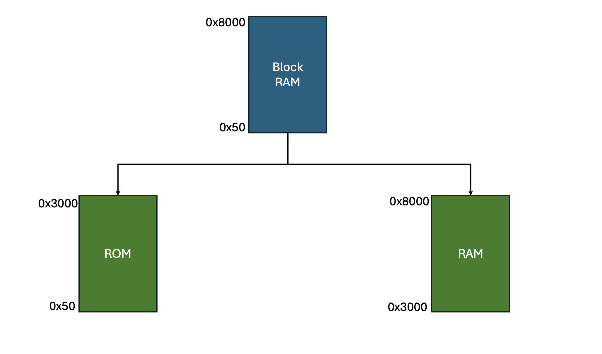

# Fixing the initialization of global (static) variables for AMD/Xilinx Microblaze(-V) processors

As we explain in our [Poster](POSTER/BRAMglobalvars_Poster_FPL24.pdf) for the ***International Conference on Field-Programmable Logic and Applications 2024 (FPL2024)***, most FPGA vendors' soft processors don't properly re-initialize global variables after a soft reset.  

You can also read our detailed [Paper](PAPER/BRAMglobalvars_FullPaper.pdf) on the issue and our proposed workarounds.

### This repository provides three types of code to fix the described issues:
### 1. Bash scripts to modify the Vitis-generated linker script to include load copy sections for global, initialized variables. There are two options to choose from:
* **1a** - Add load copies of .data sections in the same monolithic BlockRAM segment
* **1b** - Split the memory into logical ROM and RAM segments and assign load copies to ROM
	
### 2. Code to copy/re-initialize the data segments from the load copies after each reset. There are again two ways to do this:
* **2a** - Explicitly call a function from a header file at the start of your program
* **2b** - Link a static library that does the copy on each reset.

### 3. HDL module for real write protection to ROM segment from (1b)

***Current status:*** *We've tested everything both for the classic Microblaze processor and the new (RISC-V based) Microblaze-V core, up to the current 2024.1 tools, both with Vitis Classic IDE (Eclipse-based) and Vitis Unified IDE (based on VS Code/Eclipse Theia).*
 
*Contact r.willenberg@hs-mannheim.de if you have any questions.*

&nbsp;

### *[Bonus: ELF into BIT scripts:](Bonus__ELFintoBIT_scripts)* ###
*For the Microblaze-V, AMD has removed the Vitis option to initialize the downloadable bitstream with Microblaze application code and data. We are providing scripts for the old and new Vitis IDEs to keep this important functionality alive.*

## &nbsp;

## Detailed descriptions

### 1a - Add load sections

The **add_load_sections.sh** script creates new sections in the linker script.
These sections are then used by the ***.data***, ***.sdata*** and ***.tdata*** sections as *load* sections. 
For example the line
```bash
.data : AT ( __load_data_start) {
```

defines that all ***.data*** information is stored in the new section ***.load_data***. 
Later, the contents of the ***.load_data*** section are then copied to the ***.data*** section with the code from *2a* or *2b*.
 

Use the script as follows:

```bash
./add_load_sections.sh <linkerscript.ld> 
```

### 1b - Split into RAM and ROM 

The bash script **split_into_ram_rom.sh** splits a single BlockRAM memory segment in the provided linker script into two logical segments labeled ***mbRAM*** and ***mbROM***. 
Required for the command are the path to the linkerscript and a hex value which represents the start adress of the writeable (RAM) portion. 
The CLI call looks like this:

```bash
./split_into_ram_rom.sh <linkerscript.ld> <hex-value>
```

For example, for a new origin address with input **0x3000** the splitting would look something like:



For further information on how the script works, see 
[split_into_rom_ram.sh](1b__split_into_rom_ram__bash/split_into_rom_ram.sh)

### 2a - Init globals by header function call

The first way to initialize globals from the load sections is to include the provided headerfile [init_mb_globals.h](2a__init_globals__function/init_mb_globals.h). Then, the function ```init_mb_globals()``` needs to be called at the start of ```main()``` : 
```c
#include "init_mb_globals.h"

int main()
{
   init_mb_globals();  
   ...
```


### 2b - Init globals by linked library

The second way is to compile the load function into a static library's *constructor* so that it is run before the ```main()``` function is entered.

To build the library **init_mb_globals_lib.a** for the classic Microblaze, source the script [make_MB_classic_lib.sh](2b__init_globals__library/make_MB_classic_lib.sh) like this:
```bash
source make_MB_classic_lib.sh 
```

To build the library **init_mbv_globals_lib.a** for the Microblaze-V, source the script [make_MB_V_lib.sh](2b__init_globals__library/make_MB_V_lib.sh) like this:
```bash
source make_MB_V_lib.sh 
```

To be able to compile the libraries, paths to the ***mb-gcc*** and/or ***riscv\*-gcc*** tools must be known by setting the Vitis environment variables.

After successful compilation, the scripts will indicate options that must be added to the application project's linker arguments, formatted both for *Vitis Classic* and *Vitis Unified* IDE.

### 3 - Add real write protection to ROM segment

In case of using **1b** to move sections to a logical ROM segment, it is still necessary to make the segment read-only in hardware. The complete process is explained in [HOWTO.md](3___rdonly_addrfilter__vhdl/HOWTO.md).

